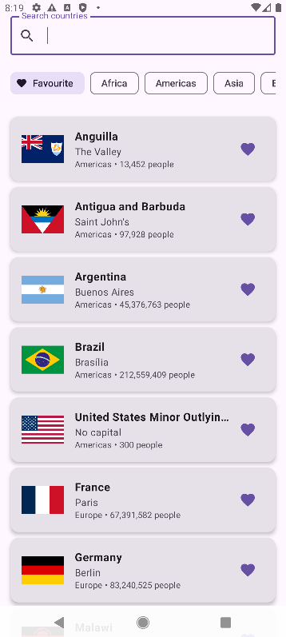
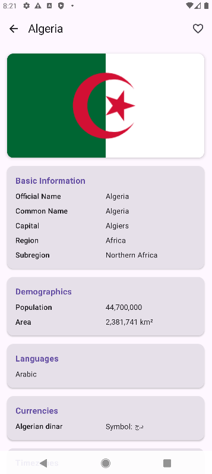
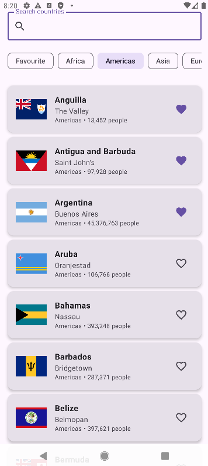
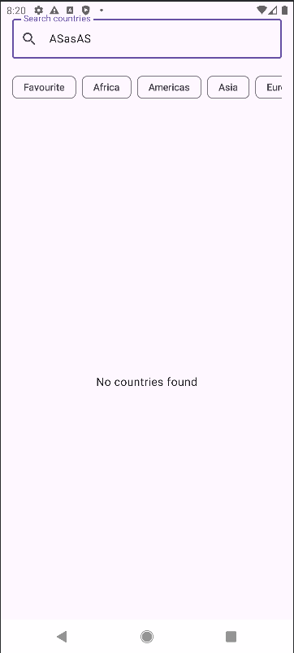

# Инф обо мне
- Рябенко Данила Игоревич
- Б9123-09.03.03ПИКД (1 группа + 2 полгруппа)

# Countries Explorer

Android приложение для изучения стран мира с использованием ApiCountries.com API.

## Функциональность выаолнено

**Навигация** - 2 экрана реализованы:
- CountriesScreen (Список/Поиск с фильтрами)
- CountryDetailScreen (Detail/{countryCode} с аргументом в route)

**Архитектура** 
- UiState паттерн: CountriesUiState и CountryDetailUiState со всеми необходимыми свойствами состояния
- ViewModel: CountriesViewModel и CountryDetailViewModel правильно реализованы
- Stateless UI: Экраны получают uiState + onEvent callbacks - полностью без состояния
- Repository паттерн: CountriesRepository находится между ViewModel и Retrofit API

**Coroutines + Retrofit** 
- Suspend функции: Все API вызовы в CountriesApi являются suspend функциями
- ViewModelScope: Все сетевые вызовы запускаются из viewModelScope.launch

**UI состояния** 
- Loading: CircularProgressIndicator с текстом "Loading..."
- Error: Сообщение об ошибке + функциональность кнопки "Retry"
- Empty: Состояния "No countries found" и "No favorite countries yet"
- Success: Отображение списка стран с правильными данными

**Избранное (локально, без БД)** 
- Добавить/Убрать: Иконка сердечка корректно переключает избранное
- Локальное хранение: Использует companion object в Repository (переживает поворот экрана)
- Постоянство: Избранное переживает поворот экрана через состояние ViewModel

**Доп**
- Debounce поиска без Flow: Job + delay(300–500ms) и отмена
- Логирование запросов (OkHttp logging)

## API

Приложение использует [ApiCountries.com](https://apicountries.com/) для получения информации о странах.

- **Полный список** - все 195+ стран мира
- **Стабильно работает** - без HTTP 400
- **Не требует API ключей** - бесплатный доступ
- **Богатые данные** - население, площадь, валюты, языки, флаги

## Скрины:

